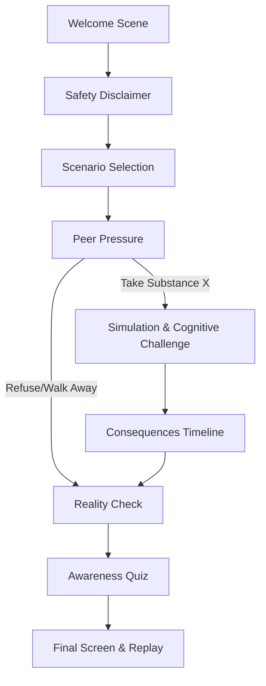

# DemoDZERO - WebXR Drug Awareness VR Simulation

## Project Overview
This project is an immersive, educational WebXR application designed to simulate the potential consequences of impaired decision-making without depicting real drugs or their usage. It is built to run directly from a web browser on compatible VR headsets, as well as providing a functional desktop fallback.

## Problem Statement
Traditional drug awareness materials often rely on scare tactics or abstract information that fails to resonate. This VR experience seeks to create an empathetic understanding of impairment and peer pressure through an interactive simulation, without providing any instructions, real-world drug names, or glorification of substance use.

## Solution
The application places the user in a fictional scenario ("Substance X") and simulates the visual and cognitive impairment that could follow risky decisions. By emphasizing the consequences rather than the substance, the application aims to foster awareness and safer choices.

## Features
- **Immersive WebXR Support**: Runs directly in VR headsets via browser without requiring app installation.
- **Desktop Fallback**: Fully functional on desktop browsers using mouse interaction.
- **Interactive Scenarios**: Experience a fictional peer pressure situation and make choices.
- **Impairment Simulation**: Visual and cognitive challenges that dynamically simulate impaired perception.
- **Educational Consequence Timeline**: A clear breakdown of immediate, short-term, and long-term risks.
- **Awareness Quiz**: Interactive quiz to reinforce key safety and decision-making concepts.
- **Comfort Controls**: Options to skip the simulation and exit at any time.

## Technology Stack
- **React** & **Vite**: Frontend framework and bundler.
- **Three.js** & **React Three Fiber**: 3D rendering and declarative scene management.
- **@react-three/xr**: WebXR integration and VR controller support.
- **Zustand**: Global state management.

## Architecture



## Local Setup

1. **Install Dependencies:**
   ```bash
   npm install
   ```

2. **Run Development Server:**
   ```bash
   npm run dev
   ```

3. **Build for Production:**
   ```bash
   npm run build
   ```

## Deployment
The project is configured to be easily deployed on standard static hosting platforms like Vercel or Netlify.
1. Connect your repository to Vercel/Netlify.
2. Set the build command to `npm run build`.
3. Set the publish directory to `dist`.
4. Ensure the site is served over **HTTPS** (required for WebXR).

## VR Testing
To test the VR capabilities:
- **Headset**: Navigate to the deployed HTTPS URL in the Meta Quest Browser (or compatible WebXR browser) and click "ENTER VR".
- **Desktop**: Install the [WebXR API Emulator](https://chrome.google.com/webstore/detail/webxr-api-emulator/mjddjgeghkdijejnciaefnkjmcenbakx) extension for Chrome/Firefox to simulate a headset and controllers.

## Future Improvements
- Expand scenarios (Stress, Party situations).
- Implement Spatial Audio using the Web Audio API.
- Add fully modeled and animated 3D characters for the scenarios.
- Include hand-tracking interactions.
- Provide multilingual subtitle support.
